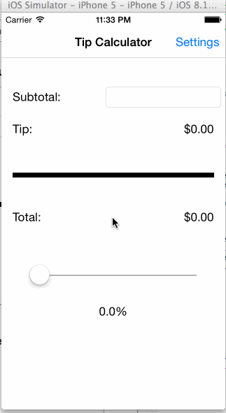

# TipCalculator

This is a swift application that helps the user calculate the amount they want to tip their waiter.

Time spent: 4 hours

Completed user stories:
Required: User can calculate the amount they want to tip by inputing bill amount and tip percentage.
Required: User can save default tip percentage for later use.
Optional: User can use a slider for more flexibility in choosing tip percentage.

Notes: spent some time fiddling with the slider to see if it is a valid solution. I like the flexibility of it, but it's slightly harder to use than the segmented control.

Walkthrough of all user stories:

